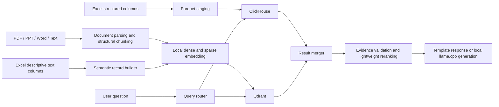

# Offline Mixed-Data Knowledge and Analytics Architecture Design

## Status

Approved in conversation on 2026-07-15. This document records the agreed target architecture before implementation planning.

## Goal

Evolve DC-Agent from its current small-scale, Python-scanned RAG prototype into a fully offline system that can answer questions across:

- PDF, PPT/PPTX, Word, Markdown, and plain-text documents.
- Excel workbooks containing tens of millions of structured rows.
- Questions that require exact filtering and aggregation.
- Questions that require semantic document retrieval.
- Mixed questions that require both structured facts and document evidence.

The system must use locally deployed, well-known open-source software and models. Runtime calls to external Embedding, Reranker, OCR, or LLM APIs are prohibited.

## Confirmed Constraints

- Data updates arrive as daily or weekly batches rather than continuous real-time events.
- Initial deployment is a single server.
- Expected hardware is 8-16 CPU cores, 32-64 GB RAM, NVMe storage, and no GPU.
- The target is at least 15 concurrent users.
- Structured and retrieval results should normally arrive within 3-5 seconds.
- Local-model answers should start streaming within 3-10 seconds when a model execution slot is available.
- At peak load, complex generation requests may queue or degrade to retrieval results and deterministic templates.
- The initial deployment does not guarantee that 15 simultaneous local-model generations all start within 10 seconds.

## Architectural Decision

Use a dual-engine architecture:

- **ClickHouse** owns structured Excel data, exact filtering, grouping, aggregation, and analytical queries.
- **Qdrant** owns document chunks and selected free-text fields that require semantic retrieval.

PostgreSQL remains the control-plane database and durable source of truth for metadata, permissions, batch state, audit records, and conversations. Redis provides caching and worker dispatch. A local `llama.cpp` service performs optional answer generation.

Excel numeric rows must not be indiscriminately converted into text and embedded. Numeric, date, categorical, and status fields stay in ClickHouse. Only explicitly configured descriptive fields such as notes, event descriptions, comments, and issue narratives are eligible for semantic indexing.

## Non-Goals

- Real-time CDC or streaming ingestion in the initial release.
- Kafka or a distributed workflow platform in the single-server deployment.
- Embedding every numeric Excel row.
- Allowing an LLM to issue unrestricted SQL.
- Guaranteeing 15 simultaneous CPU-only LLM generations within 10 seconds.
- Runtime dependence on any external API.

## System Architecture

## Component Responsibilities

### Raw File Storage

Original files are stored on local NVMe storage under a controlled data directory. Each file receives a stable source identifier, content hash, version, classification, owner, and ingestion batch identifier. Object storage such as MinIO is deferred until multi-node deployment is needed.

### PostgreSQL

PostgreSQL stores:

- File and data-source metadata.
- User, department, role, classification, and row-level access rules.
- Ingestion jobs, checkpoints, retry counts, and error details.
- Active table and collection versions.
- Query audit records, conversations, and model-run metadata.

PostgreSQL does not perform large analytical scans or vector similarity search.

### ClickHouse

ClickHouse stores Excel-derived structured data. Tables use explicit schemas, stable business keys, batch identifiers, tenant or department dimensions, and appropriate partition and ordering keys. Common business metrics are defined in a governed semantic catalog so terms such as revenue, collection rate, order count, and year-on-year growth have stable definitions.

### Qdrant

Qdrant stores:

- Structurally derived document chunks.
- Selected Excel descriptive fields.
- Dense vectors for semantic similarity.
- Sparse vectors for Chinese keyword retrieval.
- Payload fields for source, page, slide, worksheet, business record identifier, date, tenant, department, classification, and version.

Vectors and payloads use on-disk storage where appropriate. Scalar quantization is enabled after recall testing confirms acceptable quality.

### Redis

Redis stores short-lived query-plan, query-embedding, retrieval-result, and common-aggregation caches. It only wakes and dispatches workers; PostgreSQL is the unique durable job state. If Redis is lost, workers recover queued and running jobs by polling PostgreSQL.

### Local Model Runtime

`llama.cpp` serves a 1.5B-3B Chinese-capable instruct model in GGUF Q4 form. The initial runtime allows only two to four active generation slots, depending on measured CPU and memory bandwidth. Outputs are short, streamed, and capped. Requests beyond capacity queue or use deterministic fallback responses.

## Open-Source Technology Selection

- Document layout and extraction: IBM Docling.
- OCR for scanned Chinese documents and images: PaddleOCR.
- Legacy Office conversion: headless LibreOffice converts `.doc`, `.xls`, and `.ppt` into supported modern formats before parsing.
- Excel transformation: Polars and PyArrow.
- Streaming workbook readers: `openpyxl(read_only=True, data_only=True)` for `.xlsx`/`.xlsm`, `pyxlsb` row iteration for `.xlsb`, and headless LibreOffice conversion of legacy `.xls` before streaming ingestion.
- Analytical database: ClickHouse.
- Vector database: Qdrant.
- Control-plane database: PostgreSQL.
- Cache and worker dispatch: Redis; durable job state: PostgreSQL.
- Dense Embedding: FlagEmbedding with a BGE small or base Chinese model selected by benchmark.
- Sparse retrieval: Jieba tokenization, persistent vocabulary IDs, and explicitly weighted BM25 sparse vectors stored in Qdrant.
- Optional Reranker: a small BGE Reranker used only on a limited candidate set and disabled under high load.
- Local generation: llama.cpp with a locally stored Qwen-family 1.5B-3B quantized instruct model.
- SQL parsing and validation: SQLGlot.
- Load testing: Locust or k6.

All binaries, Python wheels, model weights, and container images must be mirrored into an internal artifact repository before offline deployment. Licenses and commercial-use terms must be reviewed and recorded for every tool and model.

## Batch Ingestion and Publication

### Common Batch Lifecycle

1. Register a batch and copy files into a staging directory.
2. Calculate content hashes and detect unchanged sources.
3. Parse, normalize, and validate files.
4. Write Excel staging data to Parquet.
5. Build ClickHouse staging tables and Qdrant staging collections.
6. Run row-count, schema, permission, retrieval, and referential-integrity checks.
7. Record the validated ClickHouse table name and Qdrant collection name in one PostgreSQL publication manifest.
8. Retain the previous version for rollback according to policy.

A failed file is quarantined with a clear error and does not corrupt the published version. Jobs are idempotent: retrying the same source version cannot create duplicate rows or vectors.

### Cross-Engine Publication Protocol

ClickHouse and Qdrant cannot participate in one atomic transaction. PostgreSQL coordinates publication with a `batch_id` and `published_version` manifest:

1. Build and validate both staging versions independently.
2. Give the validated ClickHouse table and Qdrant collection immutable versioned names.
3. Atomically update the PostgreSQL published pointer to the pair of physical names only when both versions report the same `batch_id`.
4. Every request pins one publication manifest at its start and addresses both physical versions from that manifest.
5. Operational aliases may be updated after publication, but queries do not depend on aliases for consistency.
6. If either build or validation fails, keep the previous pointer and delete or quarantine the partial staging version.

This provides consistent reads at the application level without incorrectly claiming a cross-database atomic commit.

### Document Parsing

- PDF parsing preserves page number, section headings, paragraphs, and tables. OCR runs only for scanned pages or pages with insufficient extracted text.
- PPT/PPTX parsing preserves slide number, title, body text, tables, speaker notes, and OCR text from meaningful images.
- Word parsing preserves heading hierarchy, paragraphs, lists, and tables.
- Text and Markdown preserve headings and logical blocks.
- Legacy `.doc`, `.xls`, and `.ppt` files are converted locally with headless LibreOffice before entering the normal parser.

Chunks are structure-aware rather than fixed-character windows. The target chunk size is 300-800 tokens with 10-15% overlap where necessary. Parent section identifiers are retained so neighboring context can be recovered without indexing oversized chunks.

### Excel Processing

- Infer and validate the workbook schema before publication.
- Require or derive stable business keys.
- Stream `.xlsx` and `.xlsm` rows with `openpyxl(read_only=True, data_only=True)` and stream `.xlsb` rows with `pyxlsb`. Convert legacy `.xls` locally with headless LibreOffice before ingestion. Formula cells use cached values and are not recalculated. Files with missing cached formula values, corrupted sheets, excessive row counts, or expansion beyond configured limits are quarantined.
- Convert worksheets to Parquet in streaming batches rather than loading entire workbooks into memory.
- Import numeric, date, categorical, and status columns into ClickHouse.
- Build semantic records only from configured descriptive columns.
- Store the ClickHouse business key in every related Qdrant point.
- Detect changed rows using keys and content hashes; regenerate vectors only for changed semantic text.
- Prefer entity-level or event-level semantic records when row-level Embedding would add little retrieval value.

### Local Embedding

Embedding runs locally in bounded CPU batches during off-peak hours. The selected model is exported to an efficient local runtime such as ONNX Runtime when benchmark results justify it. Every vector stores the model name, model version, normalization policy, and generation timestamp.

Changing the Embedding model creates a new Qdrant collection. The system evaluates the new collection before switching its alias and never mixes vectors from incompatible models.

### Sparse Retrieval Indexing

Sparse retrieval uses a versioned and reproducible pipeline:

1. Jieba tokenizes normalized Chinese text using a versioned custom dictionary and stop-word list.
2. PostgreSQL stores a vocabulary artifact that maps each accepted term to a stable integer coordinate for the current index version.
3. The batch computes document count `N`, document frequency `df(t)`, document length, and average document length `avgdl` for the published semantic corpus.
4. Initial BM25 parameters are `k1 = 1.2`, `b = 0.75`, and `k3 = 0`; query-term frequency is therefore treated as one occurrence per unique query term.
5. Document sparse values use the BM25 TF saturation and length-normalization term: `tf * (k1 + 1) / (tf + k1 * (1 - b + b * dl / avgdl))`.
6. Query sparse values use `ln(1 + (N - df + 0.5) / (df + 0.5))`, with repeated query terms deduplicated under `k3 = 0`.
7. Qdrant's automatic IDF modifier is disabled because IDF is already present in the explicit query weights.
8. Queries use the same tokenizer, dictionary, stop words, vocabulary artifact, and BM25 parameters.
9. Terms outside configured document-frequency limits are omitted to control vocabulary and noise.

The tokenizer checksum, vocabulary checksum, `N`, `avgdl`, document-frequency artifact, `k1`, `b`, and `k3` are recorded in the publication manifest. The initial implementation rebuilds sparse vectors from cached token counts for each published corpus version so BM25 statistics remain internally consistent. Dense Embedding is recomputed only for new or changed semantic records.

### Batch Window and Capacity Gates

The batch benchmark uses the same minimum scale as the online benchmark: 30 million ClickHouse rows and 5 million Qdrant points.

- The one-time initial backfill must finish within 48 hours on the target deployment profile.
- A daily batch changing no more than 5% of structured rows and semantic records must parse, validate, import, rebuild sparse weights, update Qdrant, and publish within an 8-hour off-peak window.
- A weekly full rebuild and compaction must finish within 36 hours.
- Dense vectors for unchanged semantic records are copied from the local versioned vector cache rather than recomputed.
- During batch execution, online p95 latency must remain within the stated objectives; CPU, memory, and I/O quotas enforce this separation.

If either the daily or weekly benchmark misses its window in two consecutive production-like runs, the full-rebuild publication design is not accepted. The project must choose at least one of these changes before rollout: reduce row-level semantic indexing through entity aggregation, implement a base-plus-delta Qdrant index with periodic compaction, move the deployment to the 64 GB profile, or add a second indexing node. The system must never silently allow batch work to accumulate beyond the next scheduled publication.

## Online Query Processing

### Query Classification

The router classifies a request as structured, document, or mixed. Rules and the governed metric catalog handle common cases first. The local model is used only for ambiguous intent extraction, not as the sole routing mechanism.

### Structured Queries

Structured requests become a constrained query plan rather than unrestricted SQL. The plan is mapped to approved metrics, dimensions, filters, and time ranges. SQLGlot validates the final SQL.

Controls include:

- `SELECT` only.
- Whitelisted tables, columns, functions, and metrics.
- Read-only ClickHouse credentials.
- Mandatory partition and permission filters.
- Row, memory, and execution-time limits.
- Rejection of unknown fields or ambiguous metrics.

### Document Queries

Document retrieval performs dense and sparse searches in Qdrant with identical permission and metadata filters. Reciprocal Rank Fusion combines the candidate lists. Duplicates and near-duplicate chunks are removed before lightweight reranking.

The normal path retains five to ten evidence chunks. The system returns file, page, slide, worksheet, section, and record identifiers for traceability.

### Mixed Queries

Mixed questions are decomposed into independent structured and semantic subqueries that run in parallel. Results join on governed keys such as department, project, customer, region, event, and time range.

Qdrant returns identifiers and evidence, while ClickHouse returns authoritative numeric values. The local model may explain the combined result but cannot replace or alter the retrieved facts.

## Degradation and Failure Handling

- If ClickHouse times out, return available document evidence and clearly state that structured facts are unavailable.
- If Qdrant returns no reliable evidence, return structured results without inventing a narrative cause.
- If the local model is busy, immediately return retrieval progress and either queue generation or use a deterministic template.
- If the local model fails, preserve the underlying statistics, evidence, and citations in the response.
- If the Reranker is overloaded, skip it and use fused retrieval scores.
- If disk usage exceeds the safety threshold, reject new ingestion batches before online queries are affected.
- If a new batch fails validation, keep serving the previous published version.

## Security and Permissions

Permissions are applied before retrieval and aggregation:

- PostgreSQL is the source of truth for user, department, role, classification, and data-scope rules.
- Equivalent filter fields are copied into ClickHouse columns and Qdrant payloads.
- Every query includes mandatory authorization filters.
- The model receives only facts and evidence already authorized for the current user.
- ClickHouse uses a restricted read-only query account for online requests.
- The model runtime cannot execute SQL, shell commands, or arbitrary file operations.
- Uploads are checked for extension, MIME type, size, archive expansion limits, and malicious content.
- Sensitive fields may be masked before semantic indexing.
- Queries, evidence hits, generated answers, exports, and administrative operations are audited.

## Single-Server Deployment

Docker Compose initially runs the API, PostgreSQL, ClickHouse, Qdrant, Redis, ingestion worker, and llama.cpp services on one server.

For a 64 GB host, initial memory budgets are:

- ClickHouse: 16-20 GB.
- Qdrant: 8-12 GB.
- llama.cpp: 8-12 GB.
- PostgreSQL, Redis, API, and workers: 6-8 GB combined.
- Operating system and safety headroom: at least 8 GB.

For a 32 GB host:

- Use a model near 1.5B parameters.
- Limit model concurrency to one or two.
- Enable Qdrant on-disk vectors and validated quantization.
- Prioritize retrieval and template responses during peak load.
- Do not run heavy OCR, bulk Embedding, and online model generation simultaneously.

Batch ingestion runs during off-peak windows with explicit CPU, memory, and I/O limits.

## Performance Objectives

- At 15 concurrent users, governed structured queries have p95 latency at or below 5 seconds.
- Document retrieval and evidence return have p95 latency at or below 5 seconds.
- When a local-model slot is available, first-token p95 is at or below 10 seconds.
- When all model slots are busy, the user receives queue or degradation feedback within 2 seconds.
- Batch jobs do not cause online query objectives to be missed under the agreed scheduling policy.

These objectives are acceptance targets to validate on the actual CPU, memory, NVMe, document mix, and model. They are not guaranteed by component selection alone.

### Reproducible Capacity Benchmark

The acceptance report must record the exact CPU, RAM, NVMe model, software versions, and the following workload manifest:

- At least 30 million ClickHouse rows, or the larger production target if known.
- At least 5 million Qdrant points, or the larger production target if known.
- The selected dense-vector dimension, initially benchmarked at 768 dimensions, with sparse vectors enabled.
- Authorization and metadata filters at approximately 1%, 10%, and 50% selectivity.
- Fifteen virtual users, five seconds of think time, and a 30-minute steady-state run.
- A request mix of 40% structured, 40% document retrieval, and 20% mixed questions.
- Separate cold-cache and warm-cache runs.
- Retrieval candidates capped at 50 dense and 50 sparse results, fused to at most 10 evidence chunks.
- Generated context capped at 2,048 tokens and output capped at 256 tokens, with two active model slots in the baseline run.

The 32 GB and 64 GB configurations are separate capacity profiles. If the 32 GB profile misses the objectives, deployment must reduce the semantic point count, reduce concurrency, disable optional reranking or generation, or upgrade to 64 GB. It must not inherit the 64 GB acceptance result.

## Backup and Recovery

Backups must be written to a physically separate disk or an internal NAS that is not mounted from the same storage device as the live data. Snapshots kept only on the application disk do not count as disaster recovery.

- Raw files and Parquet staging artifacts are copied daily with checksums.
- PostgreSQL receives a daily full backup plus transaction-log retention sufficient for the RPO.
- ClickHouse uses native backups for published tables and required dictionaries.
- Qdrant creates snapshots for every published collection version.
- Configuration, schema migrations, tokenizer dictionaries, vocabulary artifacts, model files, and version manifests are included.
- Backups are encrypted where required and verified by checksum after transfer.

Initial recovery targets are an RPO of 24 hours and an RTO of 4 hours. A restore exercise is run at least quarterly and after material schema, model, or storage changes. The exercise restores into an isolated location and verifies row counts, Qdrant point counts, permissions, published batch versions, and representative queries.

## Testing and Evaluation

### Functional and Data Tests

- Golden-file tests for PDF, PPT, Word, scanned document, and Excel extraction.
- Row counts, schema types, business keys, and aggregate totals match source data.
- Duplicate batches do not duplicate rows or vectors.
- Failed publication rolls back to the previous version.
- A query never combines ClickHouse and Qdrant data from different published batch versions.
- Workers recover unfinished PostgreSQL jobs after Redis is cleared or restarted.
- ClickHouse and Qdrant authorization filters return the same permitted scope.
- Every reported number traces to a ClickHouse query result.
- Every document claim traces to a source, page, slide, worksheet, or section.

### Retrieval and Answer Evaluation

- Maintain a versioned set of real business questions.
- Measure Recall@K, MRR, no-answer accuracy, citation correctness, and answer grounding.
- Compare dense-only, sparse-only, fused, and reranked retrieval.
- Run regression evaluation whenever parsing, chunking, Embedding, sparse retrieval, or reranking changes.

### Load and Failure Testing

- Use Locust or k6 for 15-30 concurrent user scenarios.
- Measure ClickHouse p50/p95, Qdrant p50/p95, cache hit rate, model queue time, and first-token latency.
- Measure initial backfill, daily 5% incremental batch, sparse-vector rebuild, Qdrant index construction, and weekly compaction duration at the declared data scale.
- Test ClickHouse timeout, Qdrant outage, model overload, Redis restart, disk pressure, corrupt files, and failed batch publication.

## Migration from the Current DC-Agent Retrieval Path

The current implementation uses fixed 600-character chunks, a local 48-dimensional hashing provider, PostgreSQL JSON vector storage, and Python full scans. Migration replaces these responsibilities incrementally:

1. Introduce durable batch metadata and structured parsers while keeping the existing API contract.
2. Move Excel analytical data to ClickHouse.
3. Replace fixed-character chunks with structure-aware document chunks.
4. Replace hashing vectors with locally generated BGE vectors in Qdrant.
5. Replace Python full scans with Qdrant dense and sparse retrieval.
6. Add governed query routing and safe ClickHouse plans.
7. Add local llama.cpp generation, queueing, and deterministic degradation.
8. Remove the legacy JSON-vector and in-memory ingestion paths after regression acceptance.

## Delivery Sequence

1. Benchmark the real server, representative Excel files, documents, and candidate local models.
2. Build the batch control plane and ClickHouse structured-data path.
3. Build document parsing, local Embedding, and Qdrant hybrid retrieval.
4. Add the query router and mixed-result joining.
5. Add local generation, streaming, queueing, caching, and degradation.
6. Complete permission enforcement, evaluation, load testing, backup, and rollback exercises.

## Acceptance Criteria

- All runtime components and model inference operate without external API calls.
- Tens of millions of Excel rows are queried through ClickHouse rather than Python or vector full scans.
- Only configured semantic Excel fields are indexed in Qdrant.
- Document answers include traceable source locations.
- Numeric answers come from validated ClickHouse results.
- Permission filters are enforced before both structured and semantic retrieval.
- Batch ingestion is idempotent, resumable, testable, and reversible.
- The system provides deterministic degradation when local model capacity is exhausted.
- The agreed 15-user performance objectives are measured on production-like data before rollout.
- Offline backups meet the 24-hour RPO and 4-hour RTO in a documented restore exercise.
