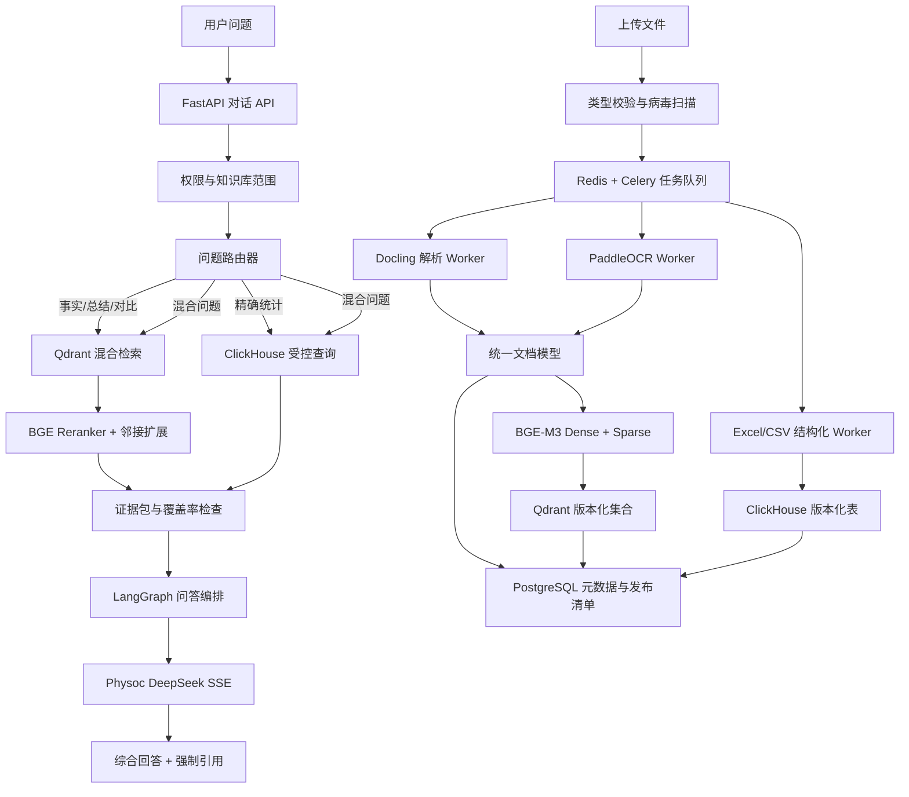

# 企业级全库知识问答与结构化分析设计

## 状态

本设计于 2026-07-24 在对话中逐节确认，作为 DC-Agent 企业内网知识库问答能力的最新总体设计。它统一文档解析、生产级混合检索、Physoc DeepSeek 综合回答、Excel/CSV 精确统计、引用、异步任务和生产验收。

当本设计与以下旧设计发生冲突时，以本设计为准：

- `2026-07-15-offline-mixed-data-architecture-design.md` 中使用 `llama.cpp`、模型失败后展示检索结果或模板的方案。
- `2026-07-21-excel-structured-aggregation-design.md` 中仅覆盖表格聚合、尚未覆盖完整全库问答的部分。
- 早期 RAG 设计中从 PostgreSQL 全量读取切片并在 Python 内逐条评分、只给模型少量切片的实现方式。

`2026-07-20-physoc-deepseek-sse-design.md` 和双模型运行时路由设计继续有效；本设计在其基础上规定生产问答、检索和证据组织方式。

## 背景与问题

当前部署后出现“询问 Excel 某列平均值，却返回切片内容”和“回答像搜索结果而不是知识库答案”的问题。根因不是单纯的提示词，而是当前链路缺少完整的生产级数据处理与问答编排：

1. 默认 `LLM_PROVIDER=template` 时不会调用 Physoc，而是直接返回检索切片。
2. 即使启用 Physoc，当前 Agent 通常只向模型提供约 5 个、每个约 500 字的片段，模型无法完成全文或跨文档总结。
3. 当前固定字符切片丢失标题、章节、页码、工作表、表格和行列范围等结构。
4. Docling 已声明为依赖但未进入正式解析链路；扫描 PDF 没有 OCR；PPTX 没有完整支持。
5. Qdrant 尚未承担正式检索，SQL Repository 会读取 PostgreSQL 中全部切片后在 Python 里逐条评分，无法支撑千万级数据。
6. Excel/CSV 数值数据若只被转换成文本切片，模型只能看到样本，无法准确计算全列或全表统计。
7. 当前提示词要求模型只依据少量可见切片回答，因此它无法总结未被送入上下文的文档内容。

## 目标

在公司内网中构建可生产部署的企业知识库，使用户能够：

- 从整个有权限访问的知识库中自动检索，不要求先选择文件。
- 对 DOCX、PDF、扫描 PDF、PPTX、TXT、Markdown 进行事实问答、全文总结、跨文档汇总和文档对比。
- 对 Excel、CSV 中已发布的结构化字段进行精确过滤和聚合，包括平均值、求和、计数、最大值、最小值和分组统计。
- 使用 `/api/physoc/deepseek/stream` 对已检索证据进行综合回答。
- 获得带文件名、页码、章节、幻灯片、工作表或单元格范围的可追溯引用。
- 在不少于 15 名并发用户下稳定使用。
- 在数千万行结构化数据和百万至千万级向量数据上扩展。

## 强制约束

- 运行时不得调用外部模型、Embedding、Reranker、OCR、解析或其他云 API。
- 只使用公司内网服务和可离线部署、知名且许可证可审查的开源组件。
- 默认生成模型为公司内网 Physoc DeepSeek 接口。
- 正文必须是综合答案；原始切片只能作为可展开证据，不能直接拼接成最终回答。
- 对证据不足的问题必须说明不足，不得编造。
- 对需要模型综合的请求，模型不可用时必须明确报错，不得降级为展示切片。
- 结构化统计必须由 ClickHouse 基于完整已发布数据计算，不能让大模型根据切片猜测。
- 所有检索与统计都必须先应用用户、部门、知识库和数据分级权限。

## 首期发布范围

### 正式支持

| 类型 | 扩展名 | 首期发布能力 |
| --- | --- | --- |
| PDF | `.pdf` | 原生文本、结构解析、页码引用、扫描页 OCR、问答和总结 |
| Word | `.docx` | 标题层级、段落、列表、表格文本、问答和总结 |
| PowerPoint | `.pptx` | 幻灯片标题、正文、备注、表格文本、图片 OCR、问答和总结 |
| 文本 | `.txt`、`.md` | 原生结构解析、问答和总结 |
| Excel | `.xlsx` | 文本检索、工作表定位、结构化导入和精确统计 |
| CSV | `.csv` | 文本检索、结构化导入和精确统计 |

### 首期不承诺

- PDF、Word、PPT 内嵌表格的跨行复杂精确统计。这些表格在首期发布中可检索、可引用、可总结，但不作为 ClickHouse 权威统计源。
- 对 `.doc`、`.ppt`、`.xls` 二进制旧格式直接解析。管理员必须先在内网使用 LibreOffice 等工具转换为新格式；系统不得把二进制内容当普通文本读取。
- 图片、音频、视频的通用知识库能力。
- 实时 CDC、Kafka 和跨数据中心部署。
- 允许大模型生成或执行任意 SQL。

### 现有界面与运行路线兼容

- 用户端已经隐藏的“快速检索、深度分析、全库检索”选择器继续隐藏；问题路由器在后台自动选择路线，默认检索当前用户有权限访问的整个知识库。
- 用户端对话框的附件入口继续保持隐藏且不删除代码。知识文档由管理端知识源页面或管理 API 上传、审核和发布，不能依赖聊天附件入口完成正式入库。
- 双模型运行时路由能力继续保留，但公司内网生产包必须选择 `physoc_deepseek` 路线，不得配置或调用外部 DeepSeek API。

## 总体架构



### 组件职责

- **FastAPI**：对话、知识源、任务状态和管理接口，不执行重型解析或全量数据扫描。
- **LangGraph**：问题路由、检索、统计、Map-Reduce 总结、证据覆盖检查和回答编排。
- **PostgreSQL**：文件、版本、权限、解析状态、发布清单、会话、引用、审计和评估结果。
- **Qdrant**：文档 Dense + Sparse 混合召回和元数据过滤。
- **ClickHouse**：Excel/CSV 全量结构化数据、精确过滤、分组和聚合。
- **Redis + Celery**：持久化异步工作分发、重试、限流和队列隔离；最终任务状态仍以 PostgreSQL 为准。
- **Docling**：PDF、DOCX、PPTX 统一布局和结构解析。
- **PaddleOCR**：扫描 PDF 和有意义图片的离线 OCR。
- **BGE-M3**：本地 Dense + Sparse 表示。
- **BGE Reranker v2 M3**：有限候选集的本地二次排序。
- **Physoc DeepSeek**：基于证据包生成综合答案，不负责检索事实和执行统计。
- **原文件存储**：单服务器默认使用受控本地目录；多节点或需要对象存储时可切换 MinIO 或公司现有内网对象存储。

## 统一文档模型

所有解析器输出同一种逻辑模型，而不是直接输出字符串切片。核心对象包括：

- `DocumentSource`：知识源、文件名、类型、内容哈希、版本、所有者、权限和解析器版本。
- `DocumentNode`：标题、章节、段落、列表、表格、图注、幻灯片、备注、OCR 区域等结构节点。
- `DocumentChunk`：用于检索的结构化片段，关联父节点和邻接节点。
- `StructuredDataset`：Excel 工作表或 CSV 数据集。
- `CitationLocator`：页码、章节路径、幻灯片号、工作表、表格号、行列或单元格范围。

每个检索片段至少保存：

- `source_id`、`source_version`、`chunk_id`、`parent_id`。
- 文件名、MIME 类型、内容哈希、解析器和解析版本。
- 标题层级和完整章节路径。
- 页码、幻灯片号、工作表名、表格号和单元格范围；不适用字段为空。
- 文本内容、语言、token 数量和相邻片段 ID。
- OCR 标识、OCR 置信度和原始区域坐标。
- 知识库、租户、部门、密级和可见范围。

## 文档解析与切片

### 解析策略

- PDF 优先读取原生文本和布局；文本不足、乱码或页面被识别为扫描页时启动 PaddleOCR。
- DOCX 保留标题层级、段落、列表、表格和图片说明。
- PPTX 保留幻灯片号、标题、正文、表格、演讲者备注，并对有意义的文本图片执行 OCR。
- TXT 和 Markdown 原生解析；Markdown 保留标题和代码块边界。
- XLSX/CSV 同时进入文本索引和结构化数据管道，但数值型全量数据不逐行无差别 Embedding。

### 结构化切片

- 按章节、段落、列表、表格和幻灯片边界切分，不再只使用固定字符窗口。
- 普通片段目标为 300-800 tokens；必要时使用约 10%-15% 重叠。
- 过长章节产生父级摘要节点和子片段，保留父子关系。
- 检索命中后可扩展相邻片段和父章节上下文，但必须受统一 token 预算约束。
- 表格文本保留表名、表头和行列定位，避免单元格脱离语义。
- 原始内容、解析结果、索引版本分开保存，便于重新解析和回滚。

### 内容版本和幂等

文件通过内容哈希去重。相同内容和相同解析版本重复提交不会生成重复节点、向量或结构化行。解析器、OCR、Embedding、Sparse 词表或切片算法升级时创建新索引版本，不覆盖正在服务的版本。

## Excel 与 CSV 结构化处理

### 双轨存储

每个 XLSX 工作表或 CSV 同时产生：

1. 面向语义检索的工作表说明、表头、业务描述和经过配置的文本字段。
2. 面向精确统计的 ClickHouse 版本化物理表。

数值、日期、分类和状态列进入 ClickHouse。备注、事件描述等确实需要语义搜索的字段才进入 Qdrant。不得将数千万行数值数据全部拼成文本切片。

### 导入流程

- XLSX 使用 `openpyxl(read_only=True, data_only=True)` 流式读取。
- CSV 流式探测编码、分隔符、表头和类型。
- 采样用于 schema 推断，正式发布仍校验全量数据。
- 数据分批写入 Parquet staging，再导入 ClickHouse，内存使用不得随总行数线性增长。
- 公式单元格只读取文件中的缓存值，不在服务端重新计算；缺少必要缓存值时发布失败并给出明确原因。
- 保存原始列名、规范列名、查询别名、类型、单位、聚合能力、空值策略和业务定义。
- 管理员确认 schema 后才能发布，未发布数据不得进入普通用户统计路线。

### 受控统计

问题路由器把明确的统计意图转换为类型化 `StructuredQueryPlan`：

- 允许的操作：`avg`、`sum`、`count`、`min`、`max`、分组和受控筛选。
- 只允许已发布的数据集、字段、指标和维度。
- SQL 由服务端基于元数据生成，并使用 SQLGlot 校验。
- ClickHouse 在线账户只读，并设置执行时间、内存和结果行数限制。
- 用户或模型不能提交原始 SQL。
- 字段或工作表存在歧义时返回澄清选项，不能退回切片猜测结果。

纯结构化统计使用确定性模板返回权威数字，可不调用 Physoc。混合问题可把不可变的统计事实交给 Physoc 解释，但模型不得改写数字。

### 聚合口径

首期允许作为聚合指标的字段仅限管理员确认的 `integer` 和定点 `decimal` 字段。平均值定义为已发布版本内、权限和显式筛选条件生效后，所有有效数值之和除以有效数值数量：

```text
avg = sum(valid_values) / count(valid_values)
```

- `null`、空单元格和空字符串不进入分子或分母，并分别计入空值数量。
- 非空但无法转换为已确认数值类型的值会导致该版本发布失败，并报告行号和列名；不得在查询时静默丢弃。
- 公式单元格使用文件保存的缓存值；用于聚合的公式缺少缓存值时发布失败。
- 隐藏行、隐藏列和 Excel 界面中的临时筛选状态属于显示属性，默认仍参与导入；只有用户问题中的显式筛选条件或已治理的数据范围规则会排除数据。
- 重复行默认保留并参与统计。只有数据集明确配置稳定业务键和去重规则时才在发布阶段去重，并将规则写入发布清单。
- 定点数按已确认的 `Decimal(P,S)` 精度导入。平均值查询由 ClickHouse 返回精确的十进制 `sum` 和整数 `count`，后端使用十进制 38 位工作精度完成除法；审计记录保存分子、分母和未格式化结果，显示值按指标配置的小数位使用 `ROUND_HALF_UP`。发布时必须验证累加范围不会溢出，整数和定点数全程不得经二进制浮点转换。
- 没有有效数值时返回“无可计算数据”，不能返回 `0` 或模型猜测值。
- 统计回答必须同时给出总行数、有效值数、空值数、筛选条件、数据版本和计算字段。

## 生产级索引与检索

### Qdrant 索引

Qdrant 正式承担在线文档检索。PostgreSQL 不再把全部切片读取到 Python 逐条计算相似度。每个 Qdrant 点保存：

- BGE-M3 Dense 向量。
- BGE-M3 Sparse 表示或经过基准验证的版本化 Sparse 表示。
- 文档、位置、权限、版本、日期和业务实体 payload。

向量模型、维度、归一化方式、Sparse 配置和词表都写入发布清单。更换模型时构建新集合，通过验证后原子切换。

### 在线检索流程

1. 根据当前用户生成强制权限和知识库范围过滤器。
2. Dense 与 Sparse 检索并行执行，各召回约 50-100 个候选。
3. 使用 RRF 或经评估确定的融合策略合并候选。
4. 去除重复和近重复片段。
5. 使用 BGE Reranker v2 M3 对有限候选集重排。
6. 对高相关片段执行父章节和相邻片段扩展。
7. 按来源多样性、相关性和 token 预算组装证据包。
8. 低于证据阈值时返回“证据不足”，不调用模型编造答案。

普通事实问答通常保留 5-10 个高质量证据块。全文总结和跨文档汇总不能沿用这一限制，必须使用层级总结。

## 问题路由与问答编排

问题路由器至少输出以下类型之一：

- `factual_qa`：具体事实问题。
- `topic_summary`：某主题在整个知识库中的汇总。
- `document_summary`：指定文档或检索到的目标文档全文总结。
- `document_compare`：多个文档、版本、制度或主体对比。
- `structured_aggregate`：Excel/CSV 精确统计。
- `follow_up`：依赖会话上下文的追问。
- `clarification`：目标、字段、工作表或时间范围有歧义。

路由采用“规则优先、模型辅助”：明确的聚合词、字段别名和指标目录由确定性规则识别；复杂语义意图可由内网 Physoc 辅助提取，但模型不拥有最终执行权限。

### 全文与全库层级总结

全文或跨文档问题使用分层 Map-Reduce：

```text
检索相关文档
→ 章节级证据与摘要
→ 文档级摘要
→ 多文档合并
→ 观点去重与冲突标注
→ 覆盖率检查
→ 最终综合回答
```

每一层输出结构化中间结果，至少包含结论、证据引用、未覆盖部分和冲突信息。只有达到覆盖阈值后才能生成最终答案；否则必须说明检索到哪些范围以及哪些范围无法确认。

### 混合问题

同时需要文档解释和精确数字的问题拆成独立子任务。Qdrant 返回语义证据，ClickHouse 返回权威统计，再按部门、项目、客户、地区、事件和时间等治理后的业务键合并。模型负责表述和解释，不能替换检索事实或统计结果。

## Physoc DeepSeek 调用

生产环境配置至少包括：

```env
LLM_PROVIDER=physoc_deepseek
LLM_API_BASE=http://内网模型服务地址:端口
LLM_STREAM_PATH=/api/physoc/deepseek/stream
LLM_MODEL=my_deepseek_r1_7b
```

上游请求保持：

```http
POST /api/physoc/deepseek/stream
Content-Type: application/json
Accept: text/event-stream
```

```json
{
  "query": "系统规则、用户问题、会话上下文和证据包组成的完整提示词",
  "model": "my_deepseek_r1_7b"
}
```

Physoc 返回 `message` 类型的 EventStream，`data` 为 JSON，其中 `response` 按到达顺序拼接，`done=true` 表示完成。现有 Physoc SSE 解析、大小限制、格式校验和安全错误映射继续使用。

首期发布保持现有前端对话 API 契约：后端完成检索、统计和 Physoc 流消费后，返回完整 `ConversationBundle`。浏览器直接消费端到端 SSE 不属于本设计的必要条件，可作为后续独立优化。

### 提示词与证据包

Physoc 获得的是完整任务提示和经过授权、筛选、重排、压缩的证据包，而不是原始用户问题或随意拼接的切片。提示词强制要求：

- 先回答问题，再给必要解释。
- 只使用证据包和不可变结构化事实。
- 合并重复信息，指出文档之间的冲突。
- 不展示检索内部评分、原始提示或未经整理的片段列表。
- 关键结论必须绑定引用。
- 证据不足时明确说明。

## 回答与引用契约

最终正文必须是自然语言综合答案。切片只能通过独立的“引用/证据”结构返回，供前端展开查看。

示例：

```text
根据已发布的销售数据，华东区订单金额平均值为 126,000 元，
基于 1,588 条有效记录计算，另有 21 条空值未参与平均值计算。
来源：[2026销售数据.xlsx / Sheet1 / B2:B1610]
```

```text
该制度于 2026 年 1 月开始执行，并同时替代 2024 年版本。
来源：[员工管理制度.pdf / 第12页 / 第三章]
```

每个引用至少包含：

- 文件名和稳定 `source_id`。
- 文件版本和内容哈希。
- 页码、章节、幻灯片、工作表、表格或单元格范围。
- 用于生成结论的证据文本或结构化查询摘要。
- 审计 ID。

模型产生的结论若无法映射到证据，回答校验器必须删除该结论、要求重新生成或将其标记为无法确认。

## 异步任务、增量更新与版本发布

### 任务队列

使用 Redis + Celery，按资源类型拆分独立队列和 Worker：

- `parser-worker`：Docling 和原生文本解析。
- `ocr-worker`：PaddleOCR，独立限制 CPU/GPU 和并发。
- `embedding-worker`：Dense/Sparse 生成和 Qdrant 写入。
- `structured-worker`：Excel/CSV 推断、Parquet staging 和 ClickHouse 导入。

任务必须具备持久化状态、幂等键、超时、有限重试、指数退避、死信队列和人工重新执行入口。不得在 Web 请求进程里执行 OCR、Embedding 或大文件导入。

### 生命周期

```text
uploaded
→ virus_scanning
→ parsing
→ parsed
→ indexing
→ ready
```

失败状态至少区分病毒扫描失败、格式不支持、解析失败、OCR 失败、schema 待确认、结构化导入失败、Embedding 失败、索引验证失败和发布失败。

### 原子发布

新版本解析和索引期间，旧版本继续提供查询。Qdrant 集合和 ClickHouse 物理表使用不可变版本名；PostgreSQL 保存同一 `batch_id` 的发布清单。只有文档索引和结构化数据都验证通过后，才原子切换活动发布指针。单次请求在开始时固定一个发布版本，避免同时读到新旧数据。

失败的新版本进入隔离区，不得破坏已发布版本。旧版本按保留策略延迟清理，支持回滚。

### 资源隔离

- OCR、Embedding、全库总结、普通问答和 ClickHouse 导入使用不同并发池。
- 批量任务优先在非高峰运行，并设置 CPU、内存、磁盘 I/O 和 GPU 配额。
- 全库总结单独限流，避免占满模型生成槽。
- 大文件和数千万行数据全部使用流式或有界批次处理。

## 异常与降级规则

- **Physoc 不可用或流格式错误**：需要模型综合的请求明确返回“模型服务暂时不可用”，不得返回切片冒充答案。
- **纯结构化统计**：若 ClickHouse 正常，可继续返回确定性统计结果；这不是模型降级。
- **ClickHouse 超时或不可用**：明确返回结构化数据不可用，不得从文本切片估算平均值等结果。
- **Qdrant 不可用**：文档问答失败；混合问题可保留权威统计，但必须说明文档证据不可用。
- **Reranker 过载**：允许使用混合召回融合排序，但记录降级事件；不得绕过权限和证据阈值。
- **证据不足**：返回无法确认以及已检索范围，不调用模型补全事实。
- **新版本发布失败**：继续服务旧版本。
- **磁盘达到安全阈值**：拒绝新导入，优先保证在线查询。
- **全库总结超时**：返回任务状态或明确超时，不返回未完成的中间切片。

## 安全与权限

- 所有服务、模型、模型权重、容器镜像和 Python/Node 包都从内网制品仓库获取。
- 上传时校验扩展名、MIME、大小、压缩展开比例和文件头，并使用 ClamAV 等开源工具扫描。
- PostgreSQL 是用户、部门、角色、知识库、密级和数据范围规则的权威来源。
- 等价权限字段复制到 Qdrant payload 和 ClickHouse 列，所有查询必须附带强制过滤条件。
- 模型只接收当前用户已经授权的证据和统计事实。
- 文档中的指令被视为不可信数据，不能覆盖系统提示、调用工具或扩大权限。
- ClickHouse 在线查询账户只读；模型运行时不能执行 SQL、Shell 或任意文件操作。
- 上传、删除、版本发布、检索、统计、证据命中、模型调用和导出均写入审计日志。
- 敏感配置使用环境变量、密码文件或公司内网密钥系统，不进入 Git。
- 生产环境使用内网 HTTPS。应用层可按现有要求保留 `allow_origins=*`，但生产入口必须由内网网关、身份认证和网络边界控制。

## 可观测性与运维

建议完全离线部署以下开源组件：

- Prometheus：API、任务、队列、检索、统计、模型和资源指标。
- Grafana：容量、延迟、错误率、索引发布和并发看板。
- Loki：集中日志检索。
- OpenTelemetry：对话请求、检索、ClickHouse、Reranker 和 Physoc 调用链追踪。

关键告警包括：任务积压、死信增长、OCR/Embedding 错误率、发布失败、模型流中断、Qdrant/ClickHouse 延迟、磁盘阈值、引用校验失败和回答无证据率。

PostgreSQL、Qdrant、ClickHouse、原文件存储和发布清单必须定期备份，并进行可恢复性演练。仅备份数据库但不备份原文件、模型版本和索引配置不视为完整备份。

## 部署拓扑

首期部署可使用 Docker Compose 在单台内网服务器部署，服务至少包括：

- Nginx。
- 用户端和管理端前端。
- FastAPI，使用 Gunicorn + Uvicorn Worker。
- parser、OCR、Embedding 和 structured Celery Worker。
- Redis、PostgreSQL、Qdrant、ClickHouse。
- Physoc DeepSeek 服务。
- 本地文件目录或 MinIO。
- Prometheus、Grafana、Loki 和 OpenTelemetry Collector。

FastAPI 只处理轻量请求；CPU/GPU 密集任务必须在 Worker 中运行。数据和索引容量超过单机资源、离线任务无法在窗口内完成或需要高可用时，再迁移 Kubernetes 或拆分索引节点，不在首期部署中提前引入不必要的集群复杂度。

## 测试与评估

### 解析回归集

建立固定的内网样本集，覆盖：

- 原生 PDF、扫描 PDF、混合文本与扫描页 PDF。
- 多级标题 DOCX、带表格和图片的 DOCX。
- 带备注、表格、图中文字的 PPTX。
- 不同编码和换行方式的 TXT/CSV。
- 多工作表、空值、重复表头、公式和混合类型 XLSX。

每个样本保存期望的章节、页码、幻灯片、工作表、行列范围和关键文本，解析器升级时自动回归。

### 检索评估

建立至少覆盖事实问答、同义词、跨章节、跨文档、时间范围、权限过滤和无答案问题的评估集。首期验收目标：

- 混合检索 `Recall@50 >= 90%`。
- 引用定位准确率 `>= 95%`。
- 无权限证据泄漏数量为 `0`。
- 没有证据的问题不得生成确定性事实答案。

### 统计评估

对 `avg/sum/count/min/max`、分组、空值和筛选条件使用 Python/Polars 离线基准结果交叉验证。所有正式支持的 Excel/CSV 验收用例结果必须完全一致；结构化统计准确率为 `100%`。

### 回答评估

回答评估同时检查：问题是否被直接回答、证据覆盖、引用映射、数字不可变、跨文档冲突是否被指出、是否出现片段堆砌和无依据结论。模型不可用、证据不足和数据源失败必须有固定的安全测试。

## 性能与容量验收

最低并发目标为 15 名用户。生产化验收使用接近真实数据规模的基准，并同时执行“恒定在途并发”和“真实用户闭环”两类测试：

- 至少 3000 万 ClickHouse 行，或已知的更大生产目标。
- 至少 500 万 Qdrant 点，或已知的更大生产目标。
- 恒定在途并发测试始终保持 15 个未完成请求，分别验证结构化统计、文档问答和混合问题；每类至少完成 500 个请求。
- 真实用户闭环测试使用 15 个虚拟用户、5 秒思考时间，升压 5 分钟、预热 5 分钟、稳定运行 30 分钟；升压和预热数据不计入验收指标。
- 请求比例：40% 结构化统计、40% 文档问答、20% 混合问题。
- 分别执行冷缓存和热缓存测试。

验收要求：

- 15 个并发请求下 EventStream 上游连接和对话请求不丢失；这不等于要求 Physoc 同时运行 15 个生成槽，超出模型槽的请求必须进入有界队列并在 2 秒内返回排队状态。
- 每种请求类型的非预期错误率分别低于 `1%`；澄清、证据不足和权限拒绝等预期业务结果单独统计，不得用于掩盖系统错误。
- 常用结构化查询和文档检索各自的 p95 不超过 5 秒，客户端验收超时为 15 秒。
- 有可用模型槽时，Physoc 首 token p95 目标不超过 10 秒；最终生成耗时单独记录。
- 模型槽满时 2 秒内给出排队或繁忙状态，不能静默卡住。
- 普通模型问答客户端验收超时为 120 秒；全库总结作为受限长任务单独验收，不混入普通问答 p95。
- 在线问答期间，解析和索引任务不得使上述指标失效。
- 全库总结限制并发并允许作为长任务执行。
- 内存不能随 Excel/CSV 总行数线性增长，数千万行不得加载到 Python 内存。

性能目标必须在实际 CPU、内存、NVMe、GPU、模型大小和文档分布上复测，组件选择本身不构成性能保证。

## 业务验收场景

系统上线前必须通过：

1. 上传 PDF、扫描 PDF、DOCX、PPTX、TXT、XLSX、CSV，后台完成解析、索引和状态展示。
2. 不指定文件时，从当前用户有权限访问的整个知识库自动检索并综合回答。
3. 对指定文档完成全文总结，并覆盖主要章节。
4. 对多个文档进行主题汇总或对比，并标出相同点、差异和冲突。
5. 对 Excel/CSV 指定列准确计算平均值、求和、计数、最大值、最小值和带筛选条件的分组统计。
6. 扫描 PDF 中的关键内容能够被检索并定位到正确页码。
7. 每个关键结论附带文件名和页码、章节、幻灯片、工作表或单元格范围。
8. 最终正文是综合答案，不能是原始切片列表。
9. 文档更新期间旧版本可查询，新版本成功后原子切换；失败时旧版本不受影响。
10. Physoc 不可用时文档问答明确失败，不展示切片；纯结构化统计仍可按确定性路线返回。
11. 未授权用户无法通过检索、引用、统计或模型上下文看到受限数据。
12. 通过不少于 15 人的并发和容量测试。

## 分阶段交付顺序

### 阶段 1：模型调用链验证

- 确认生产环境使用 `LLM_PROVIDER=physoc_deepseek`。
- 验证 POST SSE 请求、完整响应、错误映射和不展示切片的规则。
- 增加部署自检，防止生产误用 `template` provider。

### 阶段 2：统一文档解析

- 接入 Docling、PaddleOCR 和统一文档模型。
- 正式支持 PDF/DOCX/PPTX/TXT/MD/XLSX/CSV。
- 保留结构位置、内容哈希和解析版本。

### 阶段 3：生产级索引与检索

- 将在线检索迁移到 Qdrant Dense + Sparse。
- 接入 BGE-M3、BGE Reranker v2 M3、权限过滤、邻接扩展和上下文预算。
- 移除 PostgreSQL 全量切片扫描在生产检索中的职责。

### 阶段 4：问题路由和总结

- 实现路由类型、层级 Map-Reduce、覆盖率检查、引用验证和综合回答契约。
- 支持事实问答、全文总结、跨文档汇总、对比和追问。

### 阶段 5：Excel/CSV 结构化统计

- 完成 schema 确认、Parquet staging、ClickHouse 发布和受控查询计划。
- 支持精确统计和混合问题中的不可变结构化事实。

### 阶段 6：引用、评估和部署验收

- 完成引用 UI 契约、评估集、并发测试、安全测试、监控、备份和上线检查表。

每个阶段都必须有独立迁移开关和回滚路径。不得等到所有阶段完成后一次性替换生产系统。

## 开源组件与离线制品要求

正式引入前必须记录组件版本、源码仓库、许可证、模型许可证、商用限制、校验和及内网镜像位置。候选组件包括：

- IBM Docling。
- PaddleOCR。
- FlagEmbedding / BGE-M3 / BGE Reranker v2 M3。
- Qdrant。
- ClickHouse。
- PostgreSQL。
- Redis 和 Celery。
- SQLGlot。
- Polars、PyArrow、openpyxl。
- ClamAV。
- Prometheus、Grafana、Loki、OpenTelemetry。
- MinIO（需要对象存储时）。

生产服务器不得在启动或运行时自动从 GitHub、PyPI、Hugging Face、Docker Hub 或其他公网下载依赖和模型。

## 完成定义

本设计的实施只有在以下条件全部满足后才算完成：

- 首期发布支持的文件均走正式解析链路。
- Qdrant 和 ClickHouse 分别承担语义检索与权威统计。
- 全库检索、层级总结、强制引用和权限过滤可用。
- Physoc 生成的是证据驱动的综合答案，模型失败时不会展示切片。
- Excel/CSV 正式支持的统计结果达到 100% 准确。
- 自动化测试、评估集、安全测试、备份恢复和 15 人并发验收通过。
- 部署文档能够在无公网访问的公司内网复现环境。
