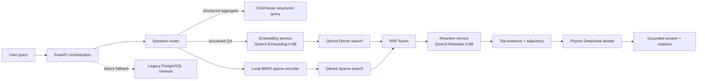

# Qwen3 Hybrid Retrieval Gray Migration Design

## Context

DC-Agent is deployed inside the company network and uses the internal Physoc DeepSeek stream
endpoint for answer generation. The current ordinary retrieval path uses fixed 600-character
chunks, a 48-dimensional `HashingEmbeddingProvider`, a PostgreSQL full-chunk scan, and Python-side
scoring. Qdrant, Redis, the Embedding Service, and ClamAV are available in the private deployment,
but Qdrant is not yet the ordinary question-answering path.

The approved retrieval models are local, open-source artifacts:

- `Qwen/Qwen3-Embedding-0.6B`
- `Qwen/Qwen3-Reranker-0.6B`

The migration must work without external API calls, preserve the existing Legacy path as a
rollback option, support at least 15 concurrent users, and target retrieval P95 latency of five
seconds or less (excluding Physoc answer generation).

## Goals

1. Add production-grade Dense + Sparse/BM25 hybrid retrieval through Qdrant.
2. Add Qwen3 Embedding and Reranker as independently deployable CPU services.
3. Preserve a working Legacy retrieval path and support Shadow comparison before cutover.
4. Keep structured spreadsheet aggregation separate from text retrieval so numeric answers are
   calculated over complete datasets rather than estimated from chunks.
5. Make model, index, rollout, and rollback versions explicit and auditable.
6. Meet the 15-user concurrency requirement and validate retrieval P95 <= 5 seconds with an
   acceptance benchmark.

## Non-goals

- Replacing the Physoc DeepSeek answer-generation provider.
- Removing the existing PostgreSQL, ClickHouse, Redis, or Legacy retrieval capabilities.
- Rewriting every document parser in the retrieval migration. The index contract preserves the
  metadata required for a later structural-parser version.
- Sending documents, queries, or model inference to an external service.

## Decision

Use separate CPU-optimized Embedding and Reranker services, with FastAPI orchestrating the query
and rollout modes. Qdrant stores versioned Dense and Sparse/BM25 vectors. PostgreSQL remains the
business source of truth for files and chunks, while ClickHouse remains the complete-data source
for spreadsheet analytics.

The runtime mode is controlled by configuration:

```text
RETRIEVAL_MODE=legacy | shadow | qwen3
```

- `legacy` executes only the current Hashing + PostgreSQL retrieval.
- `shadow` returns the Legacy answer while sampling Qwen3 retrieval in a bounded background queue
  and recording a comparison.
- `qwen3` uses Qwen3 retrieval and automatically falls back to Legacy for retrieval failures.

## Architecture and service boundaries



### FastAPI orchestration

The backend performs question routing, knowledge-base and permission filtering, mode selection,
parallel retrieval, RRF fusion, context construction, fallback, audit logging, and streaming to
the existing Physoc endpoint. It does not load either Qwen3 model.

### Embedding service

The service loads one pinned Qwen3-Embedding-0.6B artifact per process, exposes batch document and
query embedding operations, and uses CPU inference with dynamic batching and a bounded queue.
Production defaults are OpenVINO INT8 on Intel CPU and ONNX Runtime INT8 on other supported CPUs;
the standard PyTorch path remains available for compatibility and offline validation.

### Reranker service

The service loads one pinned Qwen3-Reranker-0.6B artifact per process and accepts a query plus a
bounded list of candidate passages. It returns a score for each candidate, preserving candidate
IDs so the backend can attach the original metadata. Foreground requests have priority over
Shadow and indexing work.

### Qdrant

Qdrant contains versioned collections with named `dense` and `sparse` vectors. It is an index, not
the only source of document content. Every query includes the knowledge-base, publication version,
and permission filters before scoring.

### Existing stores and Physoc

PostgreSQL remains authoritative for sources, chunks, ingestion state, permissions, and audit
records. ClickHouse stores published tabular data and executes complete-data aggregates. Physoc
receives only bounded, permission-checked evidence and generates the final answer through the
existing internal stream route.

## Indexing and data model

### Narrative documents

Word, PDF, PPT, TXT, and similar documents produce searchable passages with structural metadata.
The first migration indexes the existing parsed passages to isolate retrieval changes. Later parser
versions can publish new collections without changing the query contract. Each Qdrant payload
contains:

```text
knowledge_base_id, source_id, chunk_id, chunk_index,
parent_chunk_id, previous_chunk_id, next_chunk_id,
file_type, section_title, page_number, slide_number,
parser_version, embedding_model_version, permission_tags,
publication_version
```

The Dense vector uses Qwen3's initial 1024-dimensional normalized output. Qdrant INT8 scalar
quantization is enabled after quality verification. A 768-dimensional collection, if required by
memory limits, is a new version rather than an in-place mutation.

### Tables and spreadsheets

Full rows are published to ClickHouse in versioned physical tables. Qdrant stores only searchable
table metadata: dataset name, worksheet, column names and descriptions, types, aliases, units,
statistics summaries, and safe samples. A structured question is planned into a restricted,
parameterized ClickHouse query and checked with SQLGlot. Its result is deterministic and cannot
fall back to text chunks when ClickHouse is unavailable.

### Versioned publication

Index builds write a new Qdrant collection and record model, parser, dimension, and source
publication versions in PostgreSQL. The production Qdrant Alias changes only after point counts,
dimensions, permission filters, and representative queries pass validation. Failed or partial
builds never become visible to foreground traffic.

### Sparse/BM25 vectors

Sparse vectors are generated locally with a pinned Qdrant-compatible BM25 encoder (FastEmbed/Qdrant
BM25 implementation is the initial implementation). Its tokenizer and artifact checksum are part
of the index version. Runtime inference has no network dependency.

## Query, Shadow, and cutover flow

The router sends aggregation, sum, average, count, grouping, and similar questions to the existing
structured-answer path first. Other questions use hybrid retrieval:

1. Generate Dense and Sparse query representations in parallel.
2. Search Qdrant Dense Top 50 and Sparse Top 50 in parallel.
3. Fuse and deduplicate with Reciprocal Rank Fusion (`k=60`).
4. Rerank the fused Top 24 with Qwen3-Reranker.
5. Keep Top 5-8 evidence passages and add required parent or adjacent passages.
6. Build a bounded, cited prompt and stream the answer through Physoc.

Shadow runs the same Qwen3 steps in a separate bounded queue while the user receives Legacy output.
It records latency, result overlap, ranking metrics, evidence coverage, errors, and a redacted
comparison. Stable user or conversation hashing is used for canary assignment.

Rollout proceeds from Legacy to Shadow 10%, Shadow 50%, Shadow 100%, and then Qwen3 canaries at 5%,
25%, 50%, and 100%. The active mode and canary percentage are configuration values and are audited.

## Error handling and rollback

Embedding, Qdrant, Reranker, ClickHouse, and Physoc each have independent timeouts, bounded queues,
metrics, and circuit breakers. Qwen3 retrieval errors, queue saturation, invalid collections, or
total timeout cause an immediate Legacy fallback in `qwen3` mode. Physoc generation errors return
the existing explicit unavailability response; retrieved passages are never presented as the final
answer.

Structured-query errors remain explicit and never become chunk-based estimates.

Rollback is independent at three levels:

1. Set `RETRIEVAL_MODE=legacy` for application rollback.
2. Point the Qdrant Alias to the previous validated collection for index rollback.
3. Revert the Embedding or Reranker image to the previous pinned artifact for model rollback.

These operations do not require reparsing or re-uploading source files.

## CPU performance and capacity

The retrieval P95 budget is:

| Stage | P95 budget |
| --- | ---: |
| Routing | 100 ms |
| Dense + Sparse encoding | 900 ms |
| Qdrant searches | 500 ms |
| RRF | 100 ms |
| Reranking Top 24 | 2,600 ms |
| Context assembly | 200 ms |
| Reserve | 600 ms |

Initial CPU settings use dynamic embedding batches, a bounded reranker batch, separate process
thread pools, and foreground priority. Under load, reranker candidates reduce from 24 to 12 before
the system falls back to Legacy. Shadow and indexing work cannot consume the foreground quota.

A co-located starting profile is 32 vCPU, 64 GB RAM, and NVMe storage. Production preferably uses
separate inference, Qdrant, and ClickHouse nodes. These are sizing starting points, not guarantees;
the acceptance benchmark determines final batch sizes, worker counts, quantization, and replica
counts.

## Observability and security

All retrieval stages emit request ID, mode, model versions, collection Alias, candidate counts,
latencies, fallback reason, and outcome. Loguru exception logging includes stack traces internally,
but logs exclude full document text, user-sensitive prompts, credentials, and internal provider
payloads.

Qdrant filters enforce knowledge-base and permission tags before scoring. Model artifacts, indexes,
and dependency bundles are imported through the company's internal process and verified by checksum.
No runtime path may call an external API.

## Testing and acceptance gates

### Functional

- All supported document types index and retrieve with citations.
- Spreadsheet metadata is searchable and complete-data aggregates execute through ClickHouse.
- Dense, Sparse, RRF, Reranker, adjacency expansion, fallback, Alias publication, and idempotent
  indexing have unit and integration coverage.
- Physoc failures never expose raw retrieval chunks as answers.

### Quality

- Versioned evaluation set achieves Recall@50 >= 90%.
- NDCG@8 is no worse than Legacy, with an operational target of at least 5% improvement.
- Critical questions retain their correct evidence in Top 8.
- Structured aggregate values match direct ClickHouse results 100%.
- Permission leakage is zero.

### Performance and resilience

- At least 15 concurrent users meet retrieval P95 <= 5 seconds.
- Steady-state error rate is below 1% and unintended fallback below 1%.
- Tests cover model, Qdrant, ClickHouse, and Physoc failures, queue saturation, restart, and
  recovery.
- Index builds do not violate the foreground latency target.

### Deployment

- Model and tokenizer artifacts are present locally with verified checksums.
- A clean internal deployment starts without external network access.
- Mode changes, Alias changes, model versions, and fallback events are auditable.

## Scope and implementation order

The implementation will proceed as a reversible migration:

1. Define model-service contracts and versioned configuration.
2. Add Qdrant Dense/Sparse collection and publication support.
3. Add Qwen3 Embedding and Reranker CPU service adapters.
4. Add hybrid orchestration, RRF, adjacency expansion, and Legacy fallback.
5. Add Shadow comparison, metrics, and canary controls.
6. Add quality, concurrency, failure-injection, and deployment acceptance tests.
7. Enable Qwen3 only after the documented gates pass.

The existing document parser, structured spreadsheet publication, Physoc route, and Legacy path
remain backward compatible throughout the migration.
